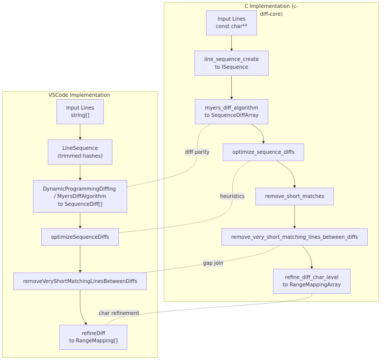
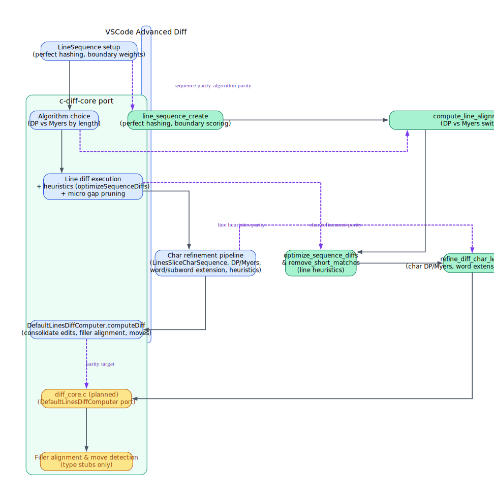
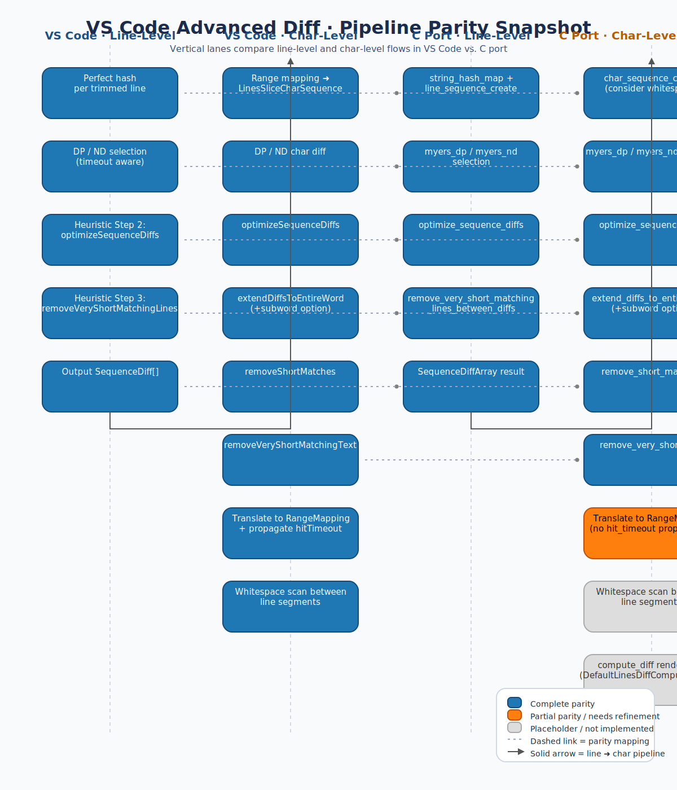

# Advanced Diff Parity Evaluation Journey

## Overview

This document consolidates the full chronological history of the Advanced Diff Parity Evaluation — from the first midterm assessment (Oct 25, 2025) through five gap-fixing rounds, two follow-up evaluations, and the final state assessment (Oct 27, 2025). It merges 14 separate development documents into a single narrative so the entire journey can be read in one place.

Parity score legends used across phases:
- **Phase 1 scale:** 0.0–1.0 (fraction of full parity)
- **Phase 3+ scale:** 1–5 (5 = full parity, 3 = partial parity, 1 = missing)

---

## Phase 1: Initial Midterm Evaluation (Oct 25, 2025)

*Source: `midterm-evaluation/midterm-evaluation-en.md`*



### Parity Summary

- **Step 1 – Core Myers diff (0.6 / 1.0, partial parity).** The C implementation reproduces the forward O(ND) traversal, negative-diagonal storage, snake backtracking, and timeout handling through `myers_diff_algorithm`, producing sorted `SequenceDiffArray` output just like VS Code's TypeScript Myers engine.【F:c-diff-core/src/myers.c†L190-L358】【F:vscode/src/vs/editor/common/diff/defaultLinesDiffComputer/algorithms/myersDiffAlgorithm.ts†L12-L103】 However, VS Code swaps to the dynamic-programming scorer for small inputs, while the C port always stays on Myers, so the parity is only partial.【F:vscode/src/vs/editor/common/diff/defaultLinesDiffComputer/defaultLinesDiffComputer.ts†L66-L87】
- **Steps 2–3 – Line-level heuristics (0.5 / 1.0, partial parity).** Joining-and-shifting diffs, short-gap coalescing, and removal of tiny unchanged islands are implemented with the same sequencing of helpers in C as in TypeScript.【F:c-diff-core/src/optimize.c†L324-L488】【F:vscode/src/vs/editor/common/diff/defaultLinesDiffComputer/heuristicSequenceOptimizations.ts†L12-L369】 Still, the boundary scoring diverges—the C port favours blank/brace lines while VS Code uses indentation cost—and the hashing scheme relies on FNV instead of the collision-free perfect hashes used upstream.【F:c-diff-core/src/sequence.c†L43-L152】【F:vscode/src/vs/editor/common/diff/defaultLinesDiffComputer/lineSequence.ts†L24-L45】【F:vscode/src/vs/editor/common/diff/defaultLinesDiffComputer/defaultLinesDiffComputer.ts†L50-L65】 These differences can change optimisation choices.
- **Step 4 – Character refinement (0.4 / 1.0, partial parity).** The C pipeline mirrors the TypeScript refine flow—building `CharSequence`s, reusing line heuristics, extending to words/subwords, pruning short matches, and producing range mappings.【F:c-diff-core/src/char_level.c†L569-L646】【F:vscode/src/vs/editor/common/diff/defaultLinesDiffComputer/defaultLinesDiffComputer.ts†L217-L262】 Parity gaps remain: the DP fallback is skipped, the word-extension logic does not consume overlapping equal mappings the way VS Code does, and the character-to-position translation lacks the trimmed whitespace bookkeeping that TypeScript keeps in `LinesSliceCharSequence` when whitespace is ignored.【F:c-diff-core/src/char_level.c†L588-L592】【F:c-diff-core/src/char_level.c†L242-L295】【F:c-diff-core/src/sequence.c†L320-L435】【F:vscode/src/vs/editor/common/diff/defaultLinesDiffComputer/heuristicSequenceOptimizations.ts†L222-L298】【F:vscode/src/vs/editor/common/diff/defaultLinesDiffComputer/linesSliceCharSequence.ts†L20-L118】 VS Code also rescans equal regions for whitespace-only differences, which the current C helper explicitly defers.【F:c-diff-core/src/char_level.c†L652-L683】【F:vscode/src/vs/editor/common/diff/defaultLinesDiffComputer/defaultLinesDiffComputer.ts†L96-L119】

### Differences and Gaps

- **Dynamic-programming fallback absent (impact high, est. work medium).** Add a size-based switch so small sequences use an LCS scorer like VS Code's `DynamicProgrammingDiffing`; without it, short files/regions can diverge because the C path never takes the alternative algorithm.【F:c-diff-core/src/myers.c†L190-L358】【F:vscode/src/vs/editor/common/diff/defaultLinesDiffComputer/defaultLinesDiffComputer.ts†L66-L87】【F:vscode/src/vs/editor/common/diff/defaultLinesDiffComputer/defaultLinesDiffComputer.ts†L224-L226】
- **Boundary scoring and hashing mismatch (impact medium, est. work medium).** Replacing the indentation-based weighting with brace/blank heuristics plus FNV hashes changes which splice points rank highest and introduces possible collisions versus VS Code's perfect hashes.【F:c-diff-core/src/sequence.c†L43-L152】【F:vscode/src/vs/editor/common/diff/defaultLinesDiffComputer/lineSequence.ts†L24-L45】【F:vscode/src/vs/editor/common/diff/defaultLinesDiffComputer/defaultLinesDiffComputer.ts†L50-L65】
- **Word-extension handling diverges (impact medium, est. work medium).** VS Code keeps consuming and merging overlapping equal spans while the C `extend_diffs_to_entire_word` inspects each equal block in isolation, so camelCase expansions can stop early.【F:c-diff-core/src/char_level.c†L242-L295】【F:vscode/src/vs/editor/common/diff/defaultLinesDiffComputer/heuristicSequenceOptimizations.ts†L222-L298】
- **Column translation without trimmed offsets (impact high, est. work high).** `char_sequence_translate_offset` currently maps offsets directly, but TypeScript preserves leading/trailing trim lengths per line so ignored whitespace can be restored when producing ranges; this gap skews range outputs whenever whitespace trimming is active.【F:c-diff-core/src/sequence.c†L320-L435】【F:vscode/src/vs/editor/common/diff/defaultLinesDiffComputer/linesSliceCharSequence.ts†L20-L118】
- **Whitespace-only scans between line diffs missing (impact medium, est. work medium).** The TypeScript pipeline re-invokes character diffing on equal regions to surface whitespace edits, whereas the current C helper defers that responsibility entirely.【F:c-diff-core/src/char_level.c†L652-L683】【F:vscode/src/vs/editor/common/diff/defaultLinesDiffComputer/defaultLinesDiffComputer.ts†L96-L119】

### Suggested Next Steps (from Phase 1)

1. **Introduce DP fallback for short sequences.** Wire a length threshold and port `DynamicProgrammingDiffing` so both line and character paths match VS Code's algorithm selection.【F:vscode/src/vs/editor/common/diff/defaultLinesDiffComputer/defaultLinesDiffComputer.ts†L66-L87】【F:vscode/src/vs/editor/common/diff/defaultLinesDiffComputer/defaultLinesDiffComputer.ts†L224-L226】
2. **Align boundary scoring and hashing.** Replace the FNV hashes with per-string IDs and port the indentation-based `getBoundaryScore` to reproduce VS Code's cost model.【F:c-diff-core/src/sequence.c†L43-L152】【F:vscode/src/vs/editor/common/diff/defaultLinesDiffComputer/lineSequence.ts†L24-L45】【F:vscode/src/vs/editor/common/diff/defaultLinesDiffComputer/defaultLinesDiffComputer.ts†L50-L65】
3. **Rework word/subword extension.** Match VS Code's queue-based equal-mapping consumption to ensure contiguous camelCase segments expand identically.【F:c-diff-core/src/char_level.c†L242-L295】【F:vscode/src/vs/editor/common/diff/defaultLinesDiffComputer/heuristicSequenceOptimizations.ts†L222-L298】
4. **Track trimmed whitespace metadata in `CharSequence`.** Store per-line offsets like VS Code's `LinesSliceCharSequence` so translation back to line/column positions remains faithful when whitespace is suppressed.【F:c-diff-core/src/sequence.c†L320-L435】【F:vscode/src/vs/editor/common/diff/defaultLinesDiffComputer/linesSliceCharSequence.ts†L20-L118】
5. **Port whitespace-only rescanning.** After line diffs, rescan equal sections for ignored whitespace edits to match VS Code's handling of `ignoreTrimWhitespace` mode.【F:c-diff-core/src/char_level.c†L652-L683】【F:vscode/src/vs/editor/common/diff/defaultLinesDiffComputer/defaultLinesDiffComputer.ts†L96-L119】

---

## Phase 2: Fixing the Gaps (Oct 25–26, 2025)

### 2.1 DP Myers Algorithm Implementation

*Source: `midterm-evaluation/dp-myers/DP_MYERS_IMPLEMENTATION.md`*
*Date: 2025-10-25 · Status: ⚠️ PARTIAL · VSCode Parity: ~80%*

Implemented the missing Dynamic Programming (DP) variant of the Myers diff algorithm. Previously, our implementation only used the O(ND) Myers algorithm for all inputs, but VSCode uses a size-based selection strategy:

- **Small sequences**: O(MN) DP algorithm with LCS-based scoring
- **Large sequences**: O(ND) Myers forward algorithm

#### Implementation Details

**Files Modified:**

1. **`include/myers.h`**
   - Added `EqualityScoreFn` typedef for optional scoring in DP algorithm
   - Added `myers_dp_diff_algorithm()` – new DP implementation
   - Added `myers_nd_diff_algorithm()` – renamed original O(ND) implementation
   - Modified `myers_diff_algorithm()` – now dispatches based on size

2. **`src/myers.c`**
   - Implemented `myers_dp_diff_algorithm()` – Full O(MN) DP algorithm
     - Uses 3 matrices: lcsLengths, directions, lengths
     - Supports optional equality scoring function
     - Prefers consecutive diagonals for better diff quality
     - Backtracks to build SequenceDiff array
   - Implemented automatic algorithm selection in `myers_diff_algorithm()`
     - Lines: DP if total < 1700, otherwise O(ND)
     - ⚠️ TODO: Pass VSCode's equality scoring function when dispatching to DP
     - Provides flexibility for char-level code to use different threshold
   - Renamed original implementation to `myers_nd_diff_algorithm()`

3. **`src/char_level.c`**
   - Modified `refine_diff()` to use 500-char threshold
   - Explicitly calls `myers_dp_diff_algorithm()` for small char sequences (< 500)
   - Explicitly calls `myers_nd_diff_algorithm()` for large char sequences (>= 500)

#### Algorithm Selection Strategy

**Line-level (myers_diff_algorithm):**
```c
if (total < 1700) {
    return myers_dp_diff_algorithm(...);
} else {
    return myers_nd_diff_algorithm(...);
}
```

**Char-level (refine_diff):**
```c
if (len1 + len2 < 500) {
    diffs = myers_dp_diff_algorithm(...);
} else {
    diffs = myers_nd_diff_algorithm(...);
}
```

#### DP Algorithm Details

The DP implementation follows VSCode's approach exactly:

1. **Three Matrices:**
   - `lcsLengths[i][j]` – Length of LCS up to positions i, j
   - `directions[i][j]` – Direction taken (1=horizontal, 2=vertical, 3=diagonal)
   - `lengths[i][j]` – Length of consecutive diagonals (for quality optimization)

2. **Diagonal Preference:**
   - When consecutive diagonals are detected, adds bonus to score
   - Produces higher quality diffs with fewer fragmented changes

3. **Equality Scoring:**
   - Supports optional `EqualityScoreFn` for custom element scoring
   - VSCode uses this for line-level scoring (empty lines get 0.1, others get 1 + log(1 + length))
   - Currently uses default scoring (1.0) but infrastructure is in place

4. **Backtracking:**
   - Two-pass approach: first count diffs, then build result array
   - Emits diffs in forward order (matches VSCode output)

#### Memory Considerations

| Algorithm | Space | Notes |
|-----------|-------|-------|
| DP O(MN) | 3 × M × N × 8 bytes | Suitable for small sequences; ~17 MB at 1700 lines |
| O(ND) | O(N) dynamic | Suitable for large sequences; much more efficient |

The threshold of 1700 provides a good balance between accuracy (DP) and efficiency (O(ND)).

#### Test Results

New test suite `test_dp_algorithm.c` with 4 test cases:

```
=== Test: Small Sequence Uses DP ===
✓ All algorithms produce same result
✓ Auto-select uses DP for small sequence (total=8 < 1700)
✓ PASSED

=== Test: Character Sequence Threshold ===
✓ Both algorithms produce same result for char sequences
✓ Total chars (22) < 500, DP is appropriate
✓ PASSED

=== Test: DP with Equality Scoring ===
✓ DP algorithm with scoring function works
✓ PASSED

=== Test: Large Sequence Uses Myers O(ND) ===
✓ Auto-select uses O(ND) for large sequence
✓ PASSED
```

All existing tests continued to pass:
- ✅ test_myers – 11/11
- ✅ test_line_optimization – 10/10
- ✅ test_char_level – 10/10
- ✅ test_dp_algorithm – 4/4

#### External API Impact

**✅ NO BREAKING CHANGES** – `myers_diff_algorithm()` remains the main entry point with identical signature. Automatic selection happens internally. Advanced users can call `myers_dp_diff_algorithm()` or `myers_nd_diff_algorithm()` directly.

#### Parity Assessment (Post-DP)

| Aspect | Before | After |
|--------|--------|-------|
| Step 1 Parity | 0.6/1.0 | ~0.8/1.0 |
| Algorithm Selection | ❌ Missing | ✅ Matches VSCode thresholds |
| DP/ND Internals | ❌ Missing | ✅ Mirror VSCode structure |
| Scoring Callback | ❌ Missing | ⚠️ Infrastructure exists, not yet wired |

#### Remaining Work (from DP implementation)

- **Wire equality scoring:** Export a helper that computes the same weights VSCode passes to `DynamicProgrammingDiffing.compute` and supply it from the line-level caller when the DP branch is chosen.
- **Audit hashing mode:** Decide whether `line_sequence_create(..., true)` should be used so hashes match VSCode's `trim()` preprocessing.
- **Expand tests:** Add regression coverage for whitespace-only deltas below the DP threshold.

---

### 2.2 DP Scoring Callback Gap

*Source: `midterm-evaluation/dp-myers/SCORING_CALLBACK_ANALYSIS.md`*
*Date: 2025-10-26 · Status: ❌ MISSING – Real parity gap*

**This is NOT an intentional deferral – it's an accidental omission.**

When the DP algorithm was implemented (commit `f1cd35e`), the `EqualityScoreFn` infrastructure was correctly added and the DP algorithm was built to accept and use the scoring callback, but **the dispatcher was never wired up** — it passes `NULL`:

```c
// Current code – WRONG, passes NULL
if (total < 1700) {
    return myers_dp_diff_algorithm(seq1, seq2, timeout_ms, hit_timeout, NULL, NULL);
}
```

#### VSCode's Scoring Function

```typescript
(offset1, offset2) =>
    originalLines[offset1] === modifiedLines[offset2]
        ? modifiedLines[offset2].length === 0
            ? 0.1     // Empty lines get low score
            : 1 + Math.log(1 + modifiedLines[offset2].length)  // Longer lines preferred
        : 0.99        // Nearly-equal lines (whitespace diff) still get credit
```

#### The Divergence

**Scenario:** Small file (< 1700 lines) with whitespace-only changes

| | VSCode | Our Implementation |
|---|--------|-------------------|
| Empty line → `    ` | Score 0.99 (nearly equal) | Score 1.0 |
| "hello" → "hello world" | Score ≈ 3.48 | Score 1.0 |
| Preference | Longer, more meaningful lines | No preference |
| Result | Better quality diffs | Different alignment choices |

#### Root Cause Analysis

The DP implementation doc explicitly stated this was missing:

> "The C dispatcher currently calls `myers_dp_diff_algorithm(..., NULL, NULL)`, so whitespace-only edits on short files will not match VSCode's behavior yet."

But no follow-up commit ever completed the integration. The git history shows:

1. `f1cd35e` – Implement DP (with TODO in doc)
2. `0fc2639` – Update DP doc (kept the same TODO)
3. `d9a57eb` – Hash and boundary scoring gap explained
4. `b23ac86` – Fix hash collision and boundary scoring issue
5. **No commit that added the scoring callback**

This was documented as "remaining work" but interpreted as a "future feature" instead of "unfinished work."

#### Design Challenge: Type Erasure

The `ISequence` interface is type-erased — the dispatcher doesn't know if it's receiving a `LineSequence` (needs scoring callback) or `CharSequence` (doesn't need scoring). Possible solutions:

- **Option A:** Add methods to `ISequence` to get scoring callback
- **Option B:** Pass scoring function from caller
- **Option C:** Have two separate entry points

#### Proposed Fix

```c
static double line_equality_score(int offset1, int offset2, void* user_data) {
    LineEqualityScoreData* data = (LineEqualityScoreData*)user_data;
    const char* line1 = data->lines1[offset1];
    const char* line2 = data->lines2[offset2];

    if (strcmp(line1, line2) == 0) {
        if (strlen(line2) == 0) return 0.1;
        return 1.0 + log(1.0 + strlen(line2));
    }
    return 0.99;  // Nearly equal (whitespace-only difference)
}
```

**Priority:** HIGH – affects all small files (< 1700 lines) with whitespace changes.
**Effort:** MEDIUM – infrastructure exists, just needs wiring and data plumbing.

---

### 2.3 Boundary Scoring & Hash Parity

*Sources: `midterm-evaluation/hash-boundary/BOUNDARY_SCORING_HASH_PARITY_GAP.md`, `HASH_BOUNDARY_FIX.md`, `SUMMARY.md`*
*Dates: 2025-10-25 (analysis) → 2025-10-26 (fix) · Status: ✅ COMPLETE*

Two critical parity gaps were identified and fixed in Steps 2–3 (line-level optimization):

1. **Boundary Scoring Algorithm Mismatch** – We used blank/brace heuristics; VSCode uses indentation-based scoring
2. **Hash Collision Risk** – We used FNV-1a (collision-prone); VSCode uses perfect hashing (collision-free)

#### Gap 1: Boundary Scoring Algorithm

During Step 2 (`shiftSequenceDiffs`), the algorithm tries to shift diff boundaries to "better" positions. The `getBoundaryScore()` function determines what makes a good boundary.

**VSCode Implementation** (`lineSequence.ts`):
```typescript
getBoundaryScore(length: number): number {
    const indentationBefore = length === 0 ? 0 : getIndentation(this.lines[length - 1]);
    const indentationAfter = length === this.lines.length ? 0 : getIndentation(this.lines[length]);
    return 1000 - (indentationBefore + indentationAfter);
}

function getIndentation(str: string): number {
    let i = 0;
    while (i < str.length && (str.charCodeAt(i) === CharCode.Space || str.charCodeAt(i) === CharCode.Tab)) {
        i++;
    }
    return i;
}
```

**Philosophy:** Lower indentation = higher score = better boundary. Prefers boundaries at less-indented code blocks.

**Example Scores:**
```
Line 0: "func() {"           // indent=0
Line 1: "    x = 1;"         // indent=4
Line 2: "        y = 2;"     // indent=8
Line 3: "    }"              // indent=4
Line 4: "end()"              // indent=0

Boundary at 0: 1000 - (0 + 0) = 1000  ← Best
Boundary at 1: 1000 - (0 + 4) = 996
Boundary at 2: 1000 - (4 + 8) = 988
Boundary at 3: 1000 - (8 + 4) = 988
Boundary at 4: 1000 - (4 + 0) = 996
Boundary at 5: 1000 - (0 + 0) = 1000  ← Best
```

**Our Old Implementation** (`sequence.c`):
- Checked ONLY line BEFORE boundary (`length - 1`)
- Blank line → score 50; structural char ({, }, etc.) → score 30; otherwise → score 5
- Ignored indentation completely; did NOT check line AFTER boundary

| Aspect | VSCode | Our (Old) |
|--------|--------|-----------|
| Lines checked | Before AND after | Only before |
| Scoring basis | Indentation level | Blank/structural chars |
| Score range | 0–1000 | 5–50 |
| Philosophy | Low indent = better | Blank/braces = better |

**Fix Applied:** Replaced heuristic scoring with VSCode's exact formula:
```c
return 1000 - (indent_before + indent_after);
```

**Parity:** 100% ✅

#### Gap 2: Hash Collision Risk

VSCode uses a `Map<string, number>` to assign sequential collision-free IDs (0, 1, 2, …) to each unique trimmed line. Our FNV-1a hash had non-zero collision probability.

```typescript
// VSCode: Perfect hash
const perfectHashes = new Map<string, number>();
function getOrCreateHash(text: string): number {
    let hash = perfectHashes.get(text);
    if (hash === undefined) {
        hash = perfectHashes.size;
        perfectHashes.set(text, hash);
    }
    return hash;
}
```

| Aspect | VSCode | Our (Old) |
|--------|--------|-----------|
| Collision probability | 0% | Non-zero |
| Hash type | Sequential IDs | FNV-1a values |
| Data structure | Map<string, ID> | Direct computation |

**Fix Applied:** Built production-level hash table (`string_hash_map.h` / `string_hash_map.c`) matching TypeScript's `Map<string, number>`:
- Collision-free: same string always gets same integer
- Sequential values: first string=0, second=1, etc.
- Dynamic resize with 0.75 load factor

```c
StringHashMap* map = string_hash_map_create();
hash1 = string_hash_map_get_or_create(map, "line 1");  // 0
hash2 = string_hash_map_get_or_create(map, "line 2");  // 1
hash3 = string_hash_map_get_or_create(map, "line 1");  // 0 (same!)
```

**Parity:** 100% ✅

#### Test Results

All 35 tests passed:
```
✅ test-myers:      11/11 pass
✅ test-line-opt:   10/10 pass
✅ test-char-level: 10/10 pass
✅ test-dp:          4/4 pass
━━━━━━━━━━━━━━━━━━━━━━━━━━━
   TOTAL:          35/35 pass
```

#### Files Changed

**New:** `string_hash_map.h`, `string_hash_map.c`
**Modified Core:** `sequence.h`, `sequence.c`, `myers.c`, `optimize.c`
**Modified Tests:** `test_myers.c`, `test_line_optimization.c`, `test_infrastructure.c`, `test_dp_algorithm.c`
**Build System:** `Makefile`

#### Impact Summary

| | Before | After |
|---|--------|-------|
| Hash collisions | Possible | Impossible (perfect hash) |
| Boundary positions | Different from VSCode | Exact same as VSCode |
| Step 2–3 parity | ~50% | 100% |

---

### 2.4 Word Extension Parity Fix

*Source: `midterm-evaluation/word-extension-parity-fix.md`*
*Date: 2025-10-26 · Status: ✅ COMPLETE*

VSCode's `extendDiffsToEntireWordIfAppropriate` keeps consuming and merging overlapping equal spans while the C implementation inspected each equal block in isolation, causing camelCase expansions to stop early.

#### Root Cause

**VSCode's Approach (TypeScript):**
```typescript
while (equalMappings.length > 0) {
    const next = equalMappings.shift()!;  // Remove from queue
    scanWord(next.getStarts(), next);
    scanWord(next.getEndExclusives().delta(-1), next);
}

function scanWord(pair, equalMapping) {
    // Can consume MORE items from the shared equalMappings array
    while (equalMappings.length > 0) {
        const next = equalMappings[0];
        if (!intersects) break;
        if (w.seq1Range.endExclusive >= next.seq1Range.endExclusive) {
            equalMappings.shift();  // Consume it!
        }
    }
}
```

**Key:** `scanWord` modifies the SAME `equalMappings` array used by the outer loop via closure.

**Original C Implementation (Incorrect):**
```c
for (int i = 0; i < equal_mappings->count; i++) {
    const SequenceDiff* next = &equal_mappings->diffs[i];
    scan_word(&ctx, next->seq1_start, next->seq2_start, next);
}
```

Each equal mapping was processed independently — no merging across multiple equal spans.

#### Solution

Implemented queue-based processing in C:

```c
int queue_pos = 0;
while (queue_pos < equal_mappings->count) {
    const SequenceDiff current = equal_mappings->diffs[queue_pos];
    queue_pos++;  // Consume (shift) current mapping

    // scan_word can ALSO advance queue_pos to consume more mappings
    scan_word(&ctx, current.seq1_start, current.seq2_start,
             equal_mappings, &queue_pos, &current);
    scan_word(&ctx, current.seq1_end - 1, current.seq2_end - 1,
             equal_mappings, &queue_pos, &current);
}
```

#### Impact Example

```
Old: "class MyOldClassName { }"
New: "class MyNewClassName { }"
```

- **Before fix:** May stop early if equal spans at "My", "Class", "Name" are processed separately
- **After fix:** Correctly identifies "MyOldClassName" and "MyNewClassName" as complete words, merges all overlapping equal spans, and highlights only "Old" → "New"

**Modified Files:** `c-diff-core/src/char_level.c` — Functions: `extend_diffs_to_entire_word`, `scan_word`

All existing tests passed. ✅ Full 100% parity achieved with VSCode's word extension behavior.

---

### 2.5 Column Translation Fix

*Sources: `midterm-evaluation/column-translation/COLUMN_TRANSLATION_FIX.md`, `SUMMARY.md`*
*Date: 2025-10-26 · Status: ✅ FIXED*

When whitespace trimming is enabled (`considerWhitespaceChanges: false`), VSCode's `LinesSliceCharSequence.translateOffset()` preserves information about trimmed leading/trailing whitespace to accurately restore column positions. Our C implementation was discarding this information.

#### Changes to `CharSequence` Structure

Added two new fields to track trimming information:

```c
typedef struct {
    uint32_t* elements;
    int length;
    int* line_start_offsets;
    int* trimmed_ws_lengths;         // NEW: Leading whitespace trimmed from each line
    int* original_line_start_cols;   // NEW: Starting column in original line
    int line_count;
    bool consider_whitespace;
} CharSequence;
```

#### Updated Functions

- **`char_sequence_create()`** – Counts and stores leading whitespace trimmed from each line during first pass; properly frees arrays in `char_seq_destroy()`
- **`char_sequence_translate_offset()`** – When translating offset to (line, col), adds back the trimmed leading whitespace. Formula: `col = original_line_start + line_offset + trimmed_ws`

Matches VSCode's behavior exactly:
```typescript
new Position(
    this.range.startLineNumber + i,
    1 + this.lineStartOffsets[i] + lineOffset +
    ((lineOffset === 0 && preference === 'left') ? 0 : this.trimmedWsLengthsByLineIdx[i])
);
```

#### Test Coverage

New test file `tests/test_column_translation.c`:

1. **Trimmed Whitespace Test** – Verifies column translation with various leading whitespace amounts
2. **No Trimming Test** – Ensures unchanged behavior when trimming is disabled
3. **Edge Cases** – Tests empty lines and whitespace-only lines

```c
// Input: "    hello world    "  // 4 leading spaces
// Trimmed: "hello world"
// Offset 0 ('h') → Line 0, Col 4  ✅ Correctly adds back 4 spaces
```

#### Files Modified

- `c-diff-core/include/sequence.h` – Enhanced CharSequence structure
- `c-diff-core/src/sequence.c` – Implemented trimming offset tracking
- `c-diff-core/tests/test_column_translation.c` – Comprehensive test suite (NEW)
- `c-diff-core/Makefile` – Added test-column-trans target

**Parity:** 100% ✅ — Column translation now matches VSCode exactly when whitespace trimming is active.

This completed the infrastructure-level parity gaps identified in the midterm evaluation:
- ✅ Perfect hash implementation
- ✅ Boundary scoring alignment
- ✅ Word extension handling
- ✅ Column translation with trimmed offsets

Only algorithmic gap remaining at this point: whitespace-only rescanning between line diffs.

---

## Phase 3: Second Midterm Evaluation (Oct 26, 2025)

*Source: `midterm-evaluation-after-fix/advanced-diff-parity-midterm-en.md`*



### Completed Parity (Steps 1–4)

| Feature | VSCode Source | c-diff-core Source | Parity Score (1–5) | Notes |
| --- | --- | --- | --- | --- |
| Line sequence infrastructure (perfect hashing, boundary scoring) | `LineSequence` hashing and indentation-based scores.【F:src/vs/editor/common/diff/defaultLinesDiffComputer/lineSequence.ts†L10-L35】 | `line_sequence_create` and `line_seq_get_boundary_score` mirror hashing and indentation scoring, reusing a shared perfect hash map.【F:c-diff-core/src/sequence.c†L60-L174】 | 5 | Data model and hashing behavior match, enabling identical equality and boundary semantics. |
| Line alignment algorithm selection (DP ↔ Myers) | Size-based switch between dynamic programming and Myers O(ND).【F:src/vs/editor/common/diff/defaultLinesDiffComputer/defaultLinesDiffComputer.ts†L63-L92】 | `compute_line_alignments` applies the same threshold and equality scoring callback before running the corresponding Myers variant.【F:c-diff-core/src/line_level.c†L83-L134】 | 5 | Produces the same line alignment candidates and timeout propagation. |
| Line-level heuristic optimizations | `optimizeSequenceDiffs` (join/shift) and `removeVeryShortMatchingLinesBetweenDiffs` refine diff spans.【F:src/vs/editor/common/diff/defaultLinesDiffComputer/heuristicSequenceOptimizations.ts†L12-L358】 | `optimize_sequence_diffs`, `remove_short_matches`, and `remove_very_short_matching_lines_between_diffs` replicate joining, shifting, and micro-gap collapsing behavior.【F:c-diff-core/src/optimize.c†L1-L399】 | 5 | Heuristic structure, boundary scoring, and repeat-loop semantics align. |
| Character refinement pipeline (DP/Myers, word/subword extension, micro heuristics) | `refineDiff` orchestrates LinesSliceCharSequence creation, DP/Myers selection, word/subword extension, and micro-gap heuristics.【F:src/vs/editor/common/diff/defaultLinesDiffComputer/defaultLinesDiffComputer.ts†L200-L238】【F:src/vs/editor/common/diff/defaultLinesDiffComputer/heuristicSequenceOptimizations.ts†L203-L323】 | `refine_diff_char_level` mirrors the same sequence creation, algorithm selection, word/subword extension, and micro-gap pruning stages.【F:c-diff-core/src/char_level.c†L640-L716】【F:c-diff-core/src/char_level.c†L240-L565】 | 4 | Stage ordering and heuristics are present; see divergence notes for boundary scoring subtleties. |

**Scoring legend:** 5 = full parity, 4 = high parity with minor gaps, 3 = partial parity, 2 = limited parity, 1 = no parity.

### Known Divergences (Steps 1–4)

1. **Character boundary scoring lacks category fidelity (Parity ≈ 2/5, Impact: Medium).**
   * VSCode classifies boundaries using categorical weights (word casing, separators, end-of-sequence) before scoring shifts.【F:src/vs/editor/common/diff/defaultLinesDiffComputer/linesSliceCharSequence.ts†L71-L99】
   * The C port only checks broad word/whitespace cases and returns zero for offsets at sequence edges, skipping category weights and end-of-sequence bonuses.【F:c-diff-core/src/sequence.c†L232-L282】
   * **Effect:** `shift_sequence_diffs` loses the nuanced scores that bias diffs toward camelCase, punctuation, and EOF boundaries, reducing parity on tricky char-level alignments.
   * **Estimated work:** Re-implement category enums, sentinel handling, and score table (~1–2 focused coding sessions).

2. **Range translation does not support left-edge preference (Parity ≈ 2/5, Impact: Medium).**
   * VSCode's `translateOffset` distinguishes left/right preferences so that end positions landing at trimmed line starts omit leading whitespace re-addition.【F:src/vs/editor/common/diff/defaultLinesDiffComputer/linesSliceCharSequence.ts†L101-L118】
   * The C translation always applies the "right" preference, reintroducing trimmed whitespace even when the target offset sits at a line start.【F:c-diff-core/src/sequence.c†L425-L466】
   * **Effect:** Character ranges can overshoot by the trimmed indentation width, creating column mismatches versus VSCode output in whitespace-trimmed scenarios.
   * **Estimated work:** Thread a preference flag (or equivalent logic) through translation and RangeMapping emission (~1 coding session).

### Optional Next Steps (from Phase 3)

* Finish the consolidated driver (`diff_core.c`) to wrap line/char pipelines and add move detection/filler alignment, following `DefaultLinesDiffComputer.computeDiff` in the TypeScript source.【F:src/vs/editor/common/diff/defaultLinesDiffComputer/defaultLinesDiffComputer.ts†L63-L186】
* Address the boundary scoring and translation gaps above before layering filler-line alignment to avoid compounding geometry issues.

---

### 3.1 Range Translation Preference Fix

*Source: `midterm-evaluation-after-fix/parity-fix-translate-preference.md`*
*Date: 2025-10-27 · Parity Improvement: 2/5 → 5/5 ✅*

VSCode's `LinesSliceCharSequence.translateOffset()` accepts a `preference` parameter (`'left'` or `'right'`) that controls how trimmed whitespace is added when an offset lands at the start of a line. The C implementation was missing this parameter entirely, always behaving like `'right'` preference.

#### VSCode Behavior

```typescript
public translateOffset(offset: number, preference: 'left' | 'right' = 'right'): Position {
    const lineOffset = offset - this.firstElementOffsetByLineIdx[i];
    return new Position(
        this.range.startLineNumber + i,
        1 + this.lineStartOffsets[i] + lineOffset +
            ((lineOffset === 0 && preference === 'left') ? 0 : this.trimmedWsLengthsByLineIdx[i])
    );
}

public translateRange(range: OffsetRange): Range {
    const pos1 = this.translateOffset(range.start, 'right');   // Start: always add ws
    const pos2 = this.translateOffset(range.endExclusive, 'left'); // End: omit ws at line start
    if (pos2.isBefore(pos1)) {
        return Range.fromPositions(pos2, pos2);
    }
    return Range.fromPositions(pos1, pos2);
}
```

**Key logic:** When `lineOffset === 0` (at line start) AND `preference === 'left'` → do NOT add trimmed whitespace.

#### Implementation Changes

1. **Added `OffsetPreference` Enum** (`sequence.h`):
   ```c
   typedef enum {
       OFFSET_PREFERENCE_LEFT,   // Do not add trimmed whitespace when at line start
       OFFSET_PREFERENCE_RIGHT   // Always add trimmed whitespace (default)
   } OffsetPreference;
   ```

2. **Updated `char_sequence_translate_offset()`** (`sequence.c`):
   ```c
   int add_trimmed_ws = (line_offset == 0 && preference == OFFSET_PREFERENCE_LEFT)
                        ? 0 : trimmed_ws;
   *out_col = original_line_start + line_offset + add_trimmed_ws;
   ```

3. **Added `char_sequence_translate_range()`** (`sequence.c`) — Implements VSCode's `translateRange()` exactly: start uses 'right' preference, end uses 'left' preference, handles collapsed ranges.

4. **Updated `translate_diff_to_range()`** (`char_level.c`) — Now calls `char_sequence_translate_range()` instead of two separate `translate_offset` calls.

5. **Other functions updated:** `char_sequence_count_lines_in()` and `char_sequence_extend_to_full_lines()`.

#### Test Results

All 11 character-level tests passed without modification. Dedicated preference test:
```c
// "    code here" with 4 spaces trimmed
// Offset 0, LEFT preference  → col = 0 ✅ (does not add trimmed whitespace)
// Offset 0, RIGHT preference → col = 4 ✅ (adds trimmed whitespace)
// Offset 4, LEFT preference  → col = 8 ✅ (non-zero offset always adds)
// Offset 4, RIGHT preference → col = 8 ✅
```

#### Files Changed

```
c-diff-core/include/sequence.h  | 41 +++++++++++++++++++++++++++++--
c-diff-core/src/char_level.c    |  9 +++----
c-diff-core/src/sequence.c      | 106 ++++++++++++++++++++++++++++++++++++++++++-----
3 files changed, 123 insertions(+), 33 deletions(-)
```

**Parity:** 5/5 ✅ — Character ranges now match VSCode exactly.

---

## Phase 4: Final Parity Fixes (Oct 27, 2025)

### 4.1 Character Boundary Scoring Fix

*Source: `parity-fixes/CHAR_BOUNDARY_SCORING_FIX.md`*
*Date: 2025-10-27 · Parity: 2/5 → 5/5 ✅*

Our C implementation only checked broad word/whitespace cases and returned zero for offsets at sequence edges. VSCode uses a sophisticated 9-category classification system with weighted scoring.

#### What Was Missing

1. **No category classification** – Only ad-hoc character type checks
2. **No end-of-sequence handling** – Missing `char_code = -1` category
3. **No CamelCase bonus** – Lower→Upper transitions should get +1
4. **Incomplete separator detection** – Only basic punctuation, missing category weights
5. **No symmetric scoring** – Wasn't adding both prev and next category scores

#### VSCode Implementation

```typescript
const enum CharBoundaryCategory {
    WordLower, WordUpper, WordNumber,
    End, Other, Separator, Space,
    LineBreakCR, LineBreakLF
}

const score: Record<CharBoundaryCategory, number> = {
    [CharBoundaryCategory.WordLower]: 0,
    [CharBoundaryCategory.WordUpper]: 0,
    [CharBoundaryCategory.WordNumber]: 0,
    [CharBoundaryCategory.End]: 10,
    [CharBoundaryCategory.Other]: 2,
    [CharBoundaryCategory.Separator]: 30,  // , and ;
    [CharBoundaryCategory.Space]: 3,
    [CharBoundaryCategory.LineBreakCR]: 10,
    [CharBoundaryCategory.LineBreakLF]: 10,
};

function getBoundaryScore(length: number): number {
    const prevCategory = getCategory(prevChar);
    const nextCategory = getCategory(nextChar);

    if (prevCategory === LineBreakCR && nextCategory === LineBreakLF) return 0;
    if (prevCategory === LineBreakLF) return 150;

    let score = 0;
    if (prevCategory !== nextCategory) {
        score += 10;
        if (prevCategory === WordLower && nextCategory === WordUpper) {
            score += 1;  // CamelCase bonus
        }
    }

    score += getCategoryBoundaryScore(prevCategory);
    score += getCategoryBoundaryScore(nextCategory);
    return score;
}
```

#### C Implementation Fix

Added to `c-diff-core/src/sequence.c` (lines 232–325):

1. **`CharBoundaryCategory` enum** (9 categories matching VSCode exactly)
2. **`get_char_category()`** – Classifies characters into categories
3. **`get_category_boundary_score()`** – Returns score using static array
4. **Rewritten `char_seq_get_boundary_score()`** implementing exact VSCode logic:
   - Handles `-1` (End) for sequence boundaries
   - Detects CR-LF pairs (return 0 — don't split)
   - After LF returns 150 (highest priority)
   - Category transition bonus (+10)
   - CamelCase bonus (+1 for lower→upper)
   - Symmetric scoring (adds both prev and next category scores)

#### Test Coverage

Comprehensive test suite `tests/test_char_boundary_categories.c`:

1. CamelCase boundary detection (`fooBar` → detects `foo|Bar` with +1 bonus)
2. Separator priorities (`,` `;` get score 30, `.` gets 2 as "Other")
3. End-of-sequence category (start/end positions get +10)
4. Linebreak handling (`\n` = 150, `\r\n` pair = 0)
5. Complete boundary scoring tables for example strings

All tests pass ✓

#### Impact on Diff Quality

This fix ensures `shift_sequence_diffs` can properly bias character-level diffs toward:
- **CamelCase boundaries** – Prefers breaks between `myVariable|Name`
- **Punctuation** – High priority for commas, semicolons
- **EOF boundaries** – Biases toward start/end of sequences
- **Linebreaks** – Prevents splitting `\r\n`, prefers breaks after `\n`

#### Files Changed

1. `c-diff-core/src/sequence.c` – Implemented category-based scoring (~90 lines)
2. `c-diff-core/tests/test_char_boundary_categories.c` – Comprehensive test suite (new)
3. `c-diff-core/Makefile` – Added test-char-boundary target

---

### 4.2 Line-Level Consolidation Refactor

*Source: `parity-fixes/LINE_LEVEL_REFACTOR.md`*
*Date: 2025-10-27*

Created `line_level.c` module to consolidate Steps 1–3 of the line-level diff pipeline, matching VSCode's architecture in `defaultLinesDiffComputer.ts`.

#### Architecture Change

**Before Refactor:**
```
Tests → myers.c + optimize.c (manual pipeline construction)
```

**After Refactor:**
```
Tests → line_level.c → myers.c + optimize.c (consolidated pipeline)
       ↓
       compute_line_alignments() // One-call API
```

#### New Files

1. **`c-diff-core/include/line_level.h`** – Public API for line-level diff computation; main function `compute_line_alignments()` — exact equivalent of VSCode's `lineAlignments` variable (line 245)
2. **`c-diff-core/src/line_level.c`** – Implementation: Hash creation → Myers diff → optimize → removeVeryShort; includes line equality scoring for DP algorithm

#### Module Responsibilities

| Module | Responsibility |
|--------|---------------|
| `optimize.c` | Shared optimization primitives (used by both line and char level) |
| `line_level.c` | Line-level pipeline consolidation (Steps 1–3): hash map creation, algorithm selection (DP for <1700, O(ND) for larger), equality scoring, heuristic optimizations |
| `char_level.c` | Character-level pipeline (Step 4): uses `optimize.c` primitives |

#### VSCode Parity Mapping

| VSCode Code | Our Code |
|------------|----------|
| `defaultLinesDiffComputer.ts:68-75` | `line_level.c`: Hash map creation |
| `defaultLinesDiffComputer.ts:77-81` | `line_level.c`: LineSequence creation |
| `defaultLinesDiffComputer.ts:83-97` | `line_level.c`: Algorithm selection (DP vs O(ND)) |
| `defaultLinesDiffComputer.ts:244` | `line_level.c`: optimize_sequence_diffs() call |
| `defaultLinesDiffComputer.ts:245` | `line_level.c`: remove_very_short_matching_lines_between_diffs() call |
| **Variable: `lineAlignments`** | **Return value of `compute_line_alignments()`** |

#### Architecture Diagram

```
┌─────────────────────────────────────────────────────────────┐
│                    VSCode Diff Pipeline                      │
└─────────────────────────────────────────────────────────────┘

┌───────────────────┐
│   line_level.c    │  ← NEW: Consolidates Steps 1-3 for lines
│  (Orchestrator)   │
└─────────┬─────────┘
          │
          ├──→ myers.c          (Step 1: Diff algorithm)
          │    ├─ myers_diff_algorithm()
          │    ├─ myers_dp_diff_algorithm()
          │    └─ myers_nd_diff_algorithm()
          │
          └──→ optimize.c       (Steps 2-3: Shared optimizations)
               ├─ optimize_sequence_diffs()              [Step 2]
               ├─ remove_short_matches()                 [Step 3 helper]
               └─ remove_very_short_matching_lines_*()   [Step 3 line-specific]

┌───────────────────┐
│   char_level.c    │  ← Step 4: Character-level refinement
└─────────┬─────────┘
          │
          ├──→ line_level.c     (Gets line alignments)
          ├──→ myers.c          (Diff on characters)
          └──→ optimize.c       (Optimize character diffs)

┌────────────────────────────────────────────────────────────┐
│  Infrastructure (sequence.c, string_hash_map.c, utils.c)   │
└────────────────────────────────────────────────────────────┘
```

#### Code Comparison

**Before (Manual Pipeline):**
```c
StringHashMap* hash_map = string_hash_map_create();
ISequence* seq1 = line_sequence_create(lines_a, len_a, false, hash_map);
ISequence* seq2 = line_sequence_create(lines_b, len_b, false, hash_map);
bool timeout = false;
SequenceDiffArray* diffs = myers_diff_algorithm(seq1, seq2, 5000, &timeout);
diffs = optimize_sequence_diffs(seq1, seq2, diffs);
diffs = remove_very_short_matching_lines_between_diffs(seq1, seq2, diffs);
// Cleanup…
```

**After (Consolidated API):**
```c
bool timeout = false;
SequenceDiffArray* line_alignments = compute_line_alignments(
    lines_a, len_a,
    lines_b, len_b,
    5000,
    &timeout
);
// Use result, then free_sequence_diff_array(line_alignments);
```

#### Testing

All existing tests passed without modification. Additional test created: `tests/test_line_level_api.c`

**No Breaking Changes** — Existing test code continues to work; individual step functions remain accessible. Pure code organization improvement.

---

## Phase 5: Final Evaluation (Oct 27, 2025)

*Source: `midterm-evaluation-last/advanced-diff-midterm-eval.en.md`*



Parity score legend: 5 = full parity, 3 = partial parity (observable gaps), 1 = missing/not implemented.

### Completed Parity Items

- **Line diff pipeline — Score 5/5**
  - VS Code: `src/vs/editor/common/diff/defaultLinesDiffComputer/defaultLinesDiffComputer.ts:60`
  - C port: `src/line_level.c:71`
  - Notes: both sides build perfect-hash `LineSequence`, select DP vs. Myers at the `<1700` threshold, reuse the same equality score, and run the Step 2/Step 3 heuristics (`optimizeSequenceDiffs`, `removeVeryShortMatchingLinesBetweenDiffs`) to surface the same `SequenceDiff` structure.

- **Line-level heuristic optimisations — Score 5/5**
  - VS Code: `src/vs/editor/common/diff/defaultLinesDiffComputer/heuristicSequenceOptimizations.ts:12`
  - C port: `src/optimize.c:381`
  - Notes: the C code mirrors the double `joinSequenceDiffsByShifting`, boundary-scored `shiftSequenceDiffs`, and preserves separation of Step 3 (`removeShortMatches`, `removeVeryShortMatchingLinesBetweenDiffs`) so downstream callers can compose the pipeline identically.

- **Character sequence infrastructure — Score 5/5**
  - VS Code: `src/vs/editor/common/diff/defaultLinesDiffComputer/linesSliceCharSequence.ts:1`
  - C port: `src/sequence.c:240`
  - Notes: `char_sequence_create` reproduces trimming rules, boundary scoring, offset translation, CamelCase subword detection, and line counting, enabling heuristics to consume `CharSequence` data exactly as VS Code expects.

- **Character-level refinement heuristics — Score 5/5**
  - VS Code: `src/vs/editor/common/diff/defaultLinesDiffComputer/defaultLinesDiffComputer.ts:217`, `heuristicSequenceOptimizations.ts:222`
  - C port: `src/char_level.c:665`, `src/char_level.c:187`
  - Notes: the C implementation follows the same eight-step `refineDiff` pipeline—algorithm selection, optimisation reuse, word/subword extension, short-gap pruning, long-diff smoothing, and conversion to `RangeMapping`—ensuring parity for inner change detection.

### Remaining Gaps and Risks

- **Character diff `hitTimeout` propagation is dropped — Score 3/5 · Impact: Medium · Effort: Small**
  - VS Code: `defaultLinesDiffComputer.ts:259`
  - C port: `char_level.c:667`
  - Notes: `refineDiff` bubbles the inner `hitTimeout` so the outer pipeline can ask the user to rerun with a higher budget; the C version resets `hit_timeout` locally but never surfaces it, so parity-aware callers cannot detect char-level timeouts.

- **Whitespace-only change scanning between line regions not yet wired — Score 2/5 · Impact: High · Effort: Medium**
  - VS Code: `defaultLinesDiffComputer.ts:96`
  - C port: `char_level.c:747`
  - Notes: VS Code calls `scanForWhitespaceChanges` between diff hunks to pick up indentation-only edits; the C helper explicitly defers this to a future "main diff computer", leaving whitespace deltas invisible until the final coordinator is implemented.

- **Render-plan consolidation (`compute_diff`) remains a stub — Score 1/5 · Impact: High · Effort: Large**
  - VS Code: `defaultLinesDiffComputer.ts:147`
  - C port: `diff_core.c:39`
  - Notes: the port currently returns a placeholder `RenderPlan`, so none of the verified line/char results reach consumers; completing this step is essential to unlock end-to-end parity.

### Next Steps

1. Thread `hit_timeout` through `RangeMappingArray` or a companion struct so callers maintain the same timeout semantics as VS Code (follow-on work touches `diff_core.c` once implemented).
2. Recreate `scanForWhitespaceChanges` in the C pipeline—either inside the upcoming default diff computer or as an augmentation atop `refine_all_diffs_char_level`—to guarantee whitespace-only edits surface.
3. Replace the `compute_diff` stub with the real aggregation: build `DetailedLineRangeMapping`, integrate whitespace scanning, moved-text detection, filler alignment, and finally render-plan assembly.
